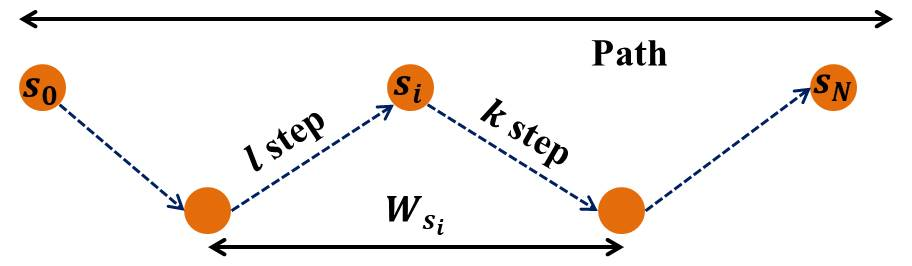
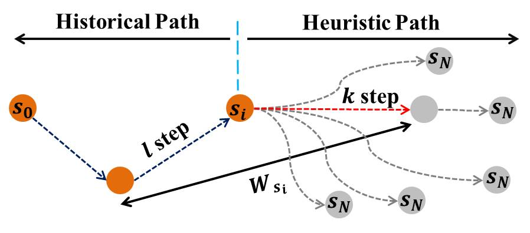
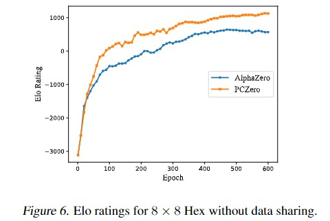
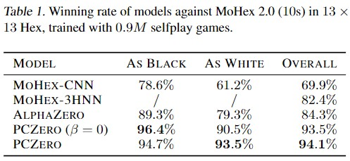
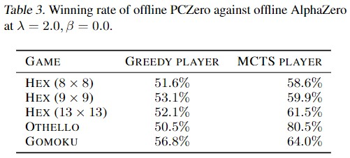

# Efficient Learning for AlphaZero via Path Consistency (ICML 2022)

This is open-source codebase for PCZero, from "Efficient Learning for AlphaZero via Path Consistency" at ICML 2022. You can find our poster here (<https://github.com/CMACH508/PCZero/blob/main/Picture/poster.pdf>) to get a quick overview of our work.

## Description

In recent years, deep reinforcement learning have made great breakthroughs on board games. However, most of the works require huge computational resources for a large scale of environmental interactions or self-play for the games. In this paper, we propose a data-efficient learning algorithm built on AlphaZero, called PCZero. Our method is based on an optimality condition in board games, called path consistency (PC), i.e., values on one optimal search path should be identical.  For implementing PC, we propose to include not only historical trajectory but also scouted search paths by Monte Carlo Tree Search (MCTS). It enables a good balance between exploration and exploitation and enhances the generalization ability effectively. PCZero obtains $94.1\%$ winning rate against the champion of Hex Computer Olympiad in $2015$ on $13\times 13$ Hex, much higher than $84.3\%$ by AlphaZero. The models consume only $900K$ self-play games, which is about the amount humans can study in a lifetime. The improvements by PCZero can be generalized to Othello and Gomoku. Experiments also demonstrate the efficiency of PCZero under offline learning setting.

In AlphaZero, $v(s)$ is computed by a deep neural network that takes the state configuration $s$ as input. PCZero will be trained by further restricting that the estimated $v(s)$ should deviate as less as possible along the optimal path. In practice, there are many possible ways to realize the PC constraint. One way is to compute the variance of the values within a sliding window $W_s$ containing state $s$, i.e.
    $$L_{\textit{PC}}(s)=(v-\bar{v})^2$$
where $\bar{v}$ is the average state value in $W_s$. For a terminated game sequence, $\bar{v}$ is averaged over the $l$ upstream nodes and $k$ downstream nodes.  While doing self-play, PCZero can be extended to calculate  ̄v using not only historical trajectory but also scouted heuristic path provided by MCTS.



## Requirements

- Python 3.6 or higher.
- Pytorch == 1.2.10
- Numpy
- $\cdots\cdots$

## Data Preparation

Expert data is needed while doing offline learning. Hex game can be download from <https://drive.google.com/drive/folders/18MdnvMItU7O2sEJDlbmk_ZzUhZG7yDK9>.  Othello data can be found in <https://www.ffothello.org/informatique/la-base-wthor/> and Gomoku is from <http://www.renju.net/downloads/games.php>.

The raw data is in sgf format and preprocessing code can be found to exact the input data of the network.

The generated data while training our $13\times 13$ Hex can be found in https://drive.google.com/file/d/1UbujmpJGv-E2hXnkUFLebZ75CKj_BuPK/view?usp=sharing, which can also be used to train the offline model.

## Training

After the dataset is ready, you can run train.py directly for offline learning.

For online learning,  execute run.sh to finish the training process.

## Testing

You can hold the competition between models by run evaluate.py for Greedy player and MCTS player. In order to compete with the expert, you need to install MoHex 2.0 <https://github.com/cgao3/benzene-vanilla-cmake> and Edax <https://github.com/abulmo/edax-reversi> first.

If you want to play Hex in real, install HexGUI from <https://github.com/ryanbhayward/hexgui>.

In order to record the training process, elo rating system is needed.

While competing with MoHex 2.0, the search time is limited to $10$s. Therefore, the tournament results is related with the machine to conduct the experiment. In our paper, we use the machine with a single GTX $1050Ti$ GPU and Intel $i7$ $8750H$ CPU with $16$ GB RAM.

While conducting competitions for Othello, opening positions are generated following the method in "Preference learning for move prediction and evaluation function approximation in Othello".

## Example


## Results

The elo rates while learning in online manner for Hex is



The tournament results is listed as below. Table $1$ is the winning rate against MoHex $2.0$. PCZero obtains $94.1\%$ winning rate, much higher than AlphaZero's $84.3\%$.Table $3$ is the winning rate of PCZero against AlphaZero while training in offline manner. MCTS player obtains much better performance than Greedy player because PCZero provides more reliable value estimation.





## Citation

If you find this repo useful, please cite our paper:

```
@InProceedings{pmlr-v162-zhao22h,
  title = 	 {Efficient Learning for {A}lpha{Z}ero via Path Consistency},
  author =       {Zhao, Dengwei and Tu, Shikui and Xu, Lei},
  booktitle = 	 {Proceedings of the 39th International Conference on Machine Learning},
  pages = 	 {26971--26981},
  year = 	 {2022},
  editor = 	 {Chaudhuri, Kamalika and Jegelka, Stefanie and Song, Le and Szepesvari, Csaba and Niu, Gang and Sabato, Sivan},
  volume = 	 {162},
  series = 	 {Proceedings of Machine Learning Research},
  month = 	 {17--23 Jul},
  publisher =    {PMLR}
}

```

## Contact

If you have any question or want to use the code, please contact <zdwccc@sjtu.edu.cn>

## Acknowledgement

We appreciate the following github repos greatly for their valuable code base implementations:

<https://github.com/cgao3/benzene-vanilla-cmake>

<https://github.com/kenjyoung/Neurohex>

<https://github.com/abulmo/edax-reversi>

<https://www.remi-coulom.fr/Bayesian-Elo/>


